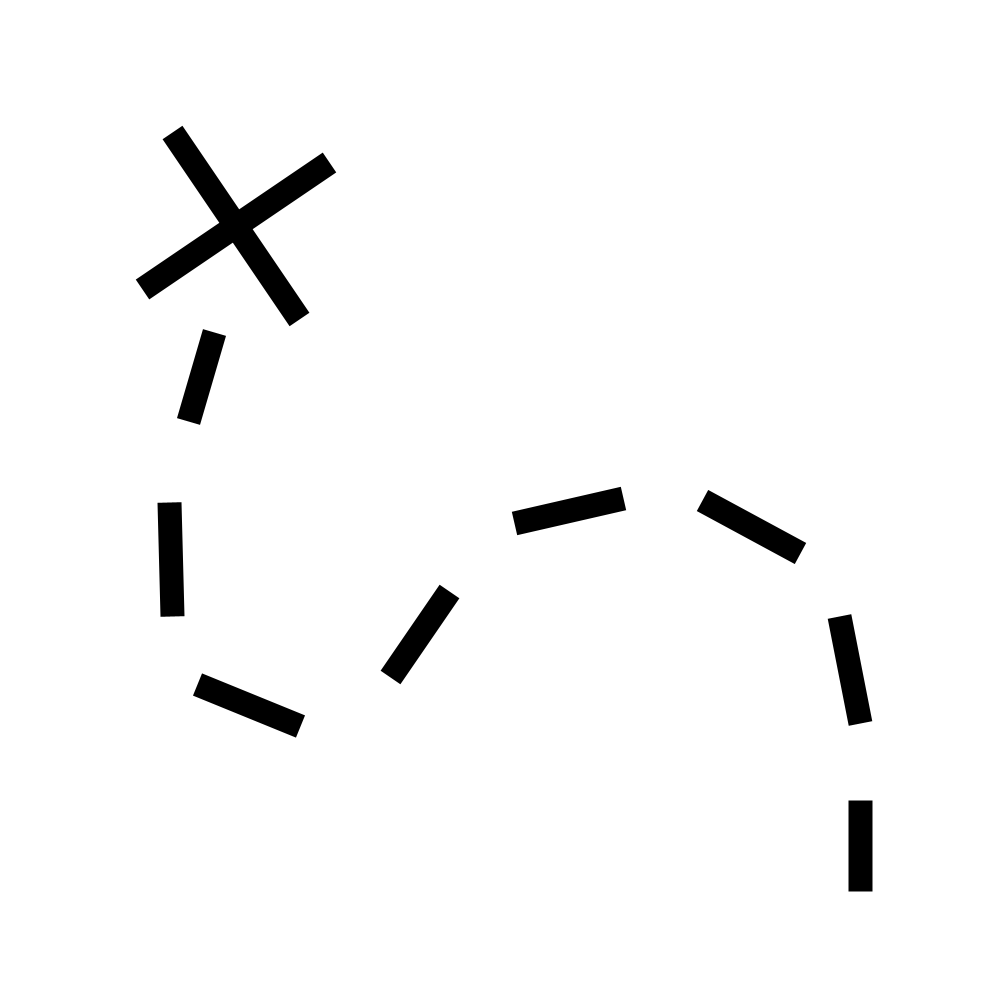
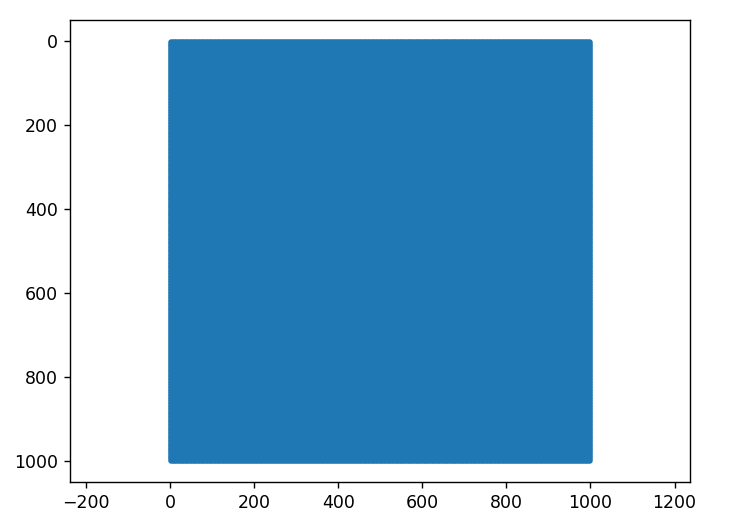
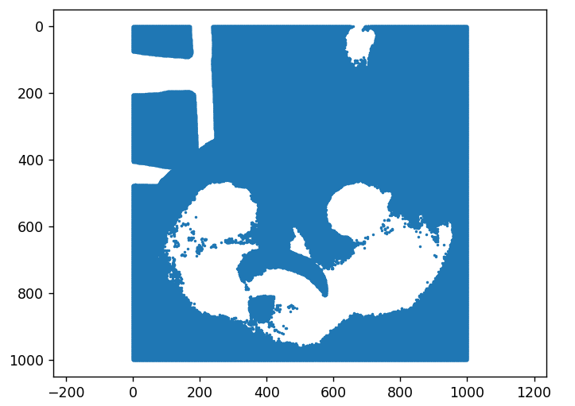
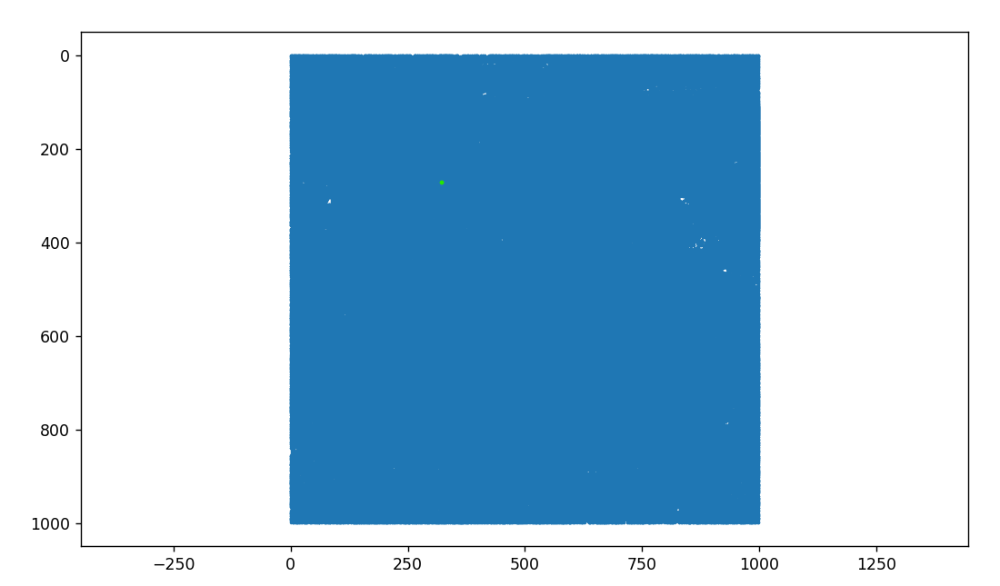
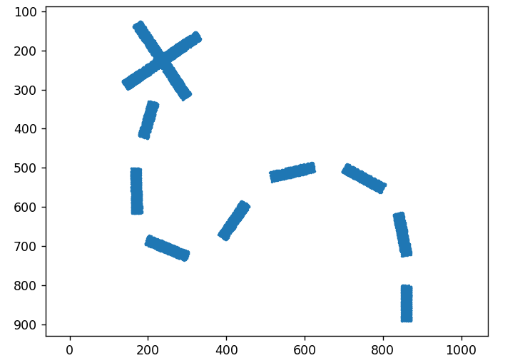
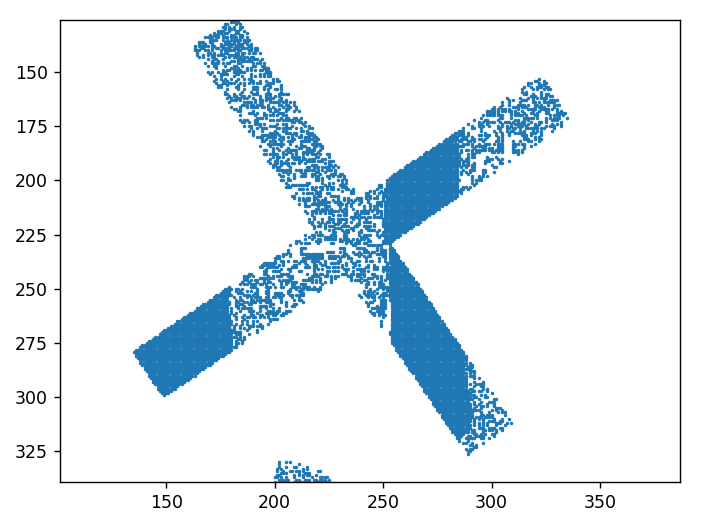
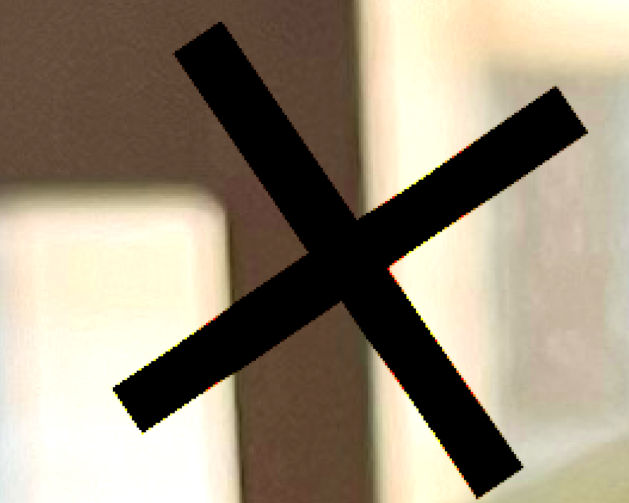
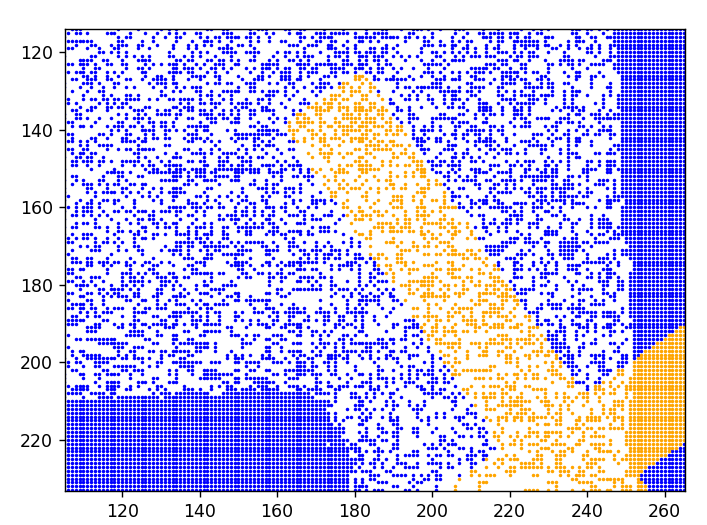
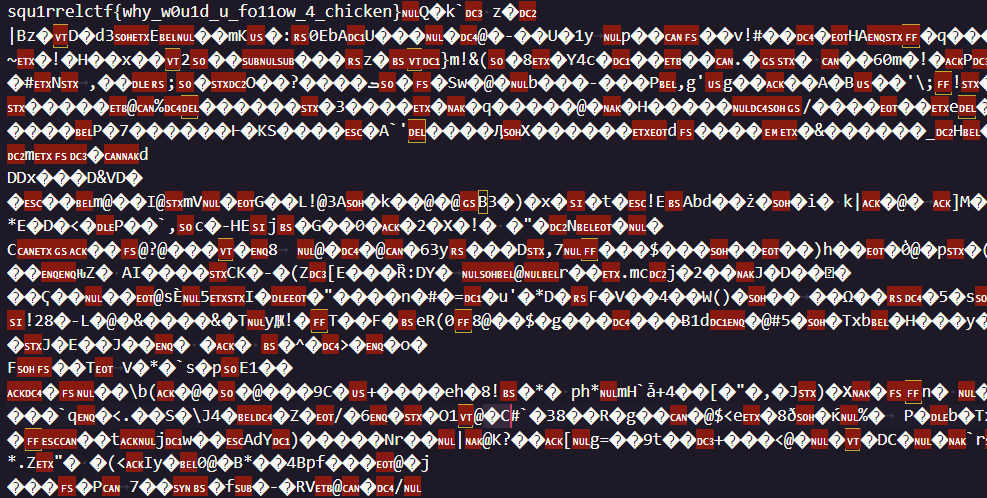

# Chicken Treasure Hunt

## Challenge

Title: Chicken Treasure Hunt

Category: Misc

> Chicken has given you a treasure map to find the flag!
>
> Hint: Chicken’s favorite color is red
>
> Hint 2: A treasure map tells you where to look
>
> Hint 3: Count non-white pixels as black

Attached: `suspicious_chicken.png`, `treasure_map.png`

## Writeup

Everyone's favourite category: steganography.

Introducing Chicken Treasure Hunt:

We are given two PNGs. A suspicious chicken:

And a treasure map:

Looking at the first hint: `Chicken’s favorite color is red`

This is *probably* implying something about the Red RGB channel. 

A common technique is to hide data in the bit planes.

Each colour in RGB is stored using 8-bits, you might know this as 0 to 255.

0 is the minimum value as it is represented by `00000000`

255 is the maximum value as it is represented by `11111111`

Let's begin by looking at all of the pixels where the R value is greater than 0. This can be plotted using Python's `matplotlib`.

Okay... looks like just about every single pixel contains *some* amount of red. Not exactly very helpful.

Let's try analysing the bits more closely.

We can create a bit mask `0b10000000`

*In Python, `0b` denotes a binary number*

This bit mask highlights the leftmost bit, also known as the most significant bit (MSB). This is because if it is present, then it has the biggest contribution on the overall number.

I.e. if the leftmost bit is 1, then we know that `R >= 128`

Okay, a little better. Unsurprisingly, the very red areas are highlighted. But still, nothing seems to be obvious.

Hiding data in the MSB is rarely done as it has the potential to affect the image visually. After all, if we have to make our image a lot more red (or any other channel for that matter), then just from looking at the image you might be able to see the data.

So let's try the opposite end of the spectrum: the least significant bit (LSB).

The bit mask for this is `0b00000001`

If the rightmost bit is present, then the R value is odd, otherwise it is even. Since this one-value difference is very subtle, you are unlikely to notice it unless you are specifically examining the LSB bits.

Still not a whole lot to be gained from this. We can see that some of the pixels do contain the LSB, while others don't. The image appears to suggest that *most* pixels do contain the Red LSB, although it's hard to tell from this image alone as there are so many pixels being crammed in on a small plot.

Let's try combining this with the treasure map.

`Hint 2: A treasure map tells you where to look`

This seems to suggest that we only need to look at the R pixels that match up with the treasure map.

`Hint 3: Count non-white pixels as black`

The treasure map isn't 100% black and 100% white, there is some anti-aliasing present. This suggests that instead of looking at the black pixels, we should be looking at the *non-white* pixels.

Let's plot the R LSB pixels that match up with the non-white pixels of the treasure map.

**ENHANCE**

We're finally getting somewhere! It's pretty suspicious how some parts of the X all contain the LSB, while for others it seems to jump back and forth.

But wait... could that just be the chicken containing strange red values coincidentally?

Possibly! Let's return to the original image momentarily.

Hmm... it seems like the solid LSB sections overlap with the light, and the sporadic LSB sections overlap with the brown things in the background.

It's entirely possible these sporadic sections are just a coincidence, as the LSB only affects the R channel by *one* value.

Let's take a step back and ignore the sections which overlap with the X for now. To check if these sporadic LSB pixels are just a coincidence, let's highlight the LSBs that overlap with the X in orange, and the ones that don't overlap in blue.

Okay great, this solves all of our problems. Oh, wait, it doesn't... Looks like it's completely indistinguishable between the arrangement of LSB pixels within the X and outside the X.

Welcome to stego!

Let's try taking these LSB bits that overlap with the X and converting them to ASCII. Essentially, grouping them into blocks of 8, converting them to their ascii character equivalent, and then outputting them to the file `byte_data.bin`

Oh look, there's the flag.

`squ1rrelctf{why_w0u1d_u_fo11ow_4_chicken}`
