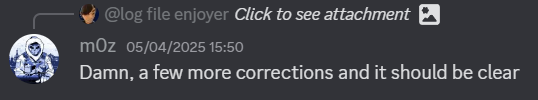
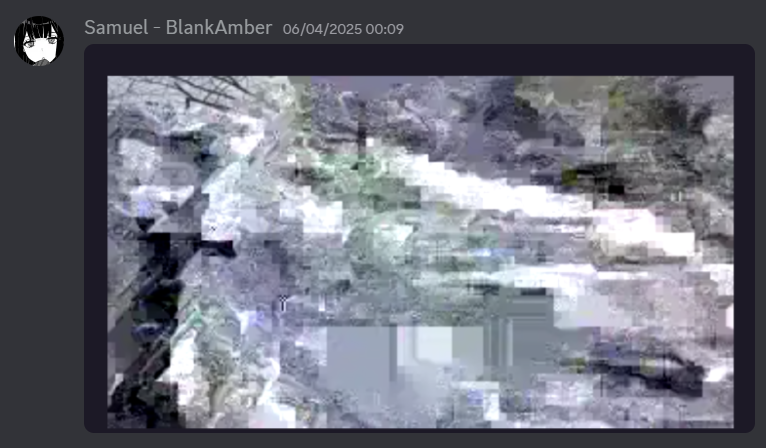

# Geoguessr

## Challenge

Title: Geoguessr

Category: OSINT

Solves: 2

> Can you tell me where I was this weekend? My service wasn’t great, so my image didn’t upload properly—hope it’s not a problem!
>
> (hint: it’s got a specific name!)

Attached: `pics.pdf`

## Writeup

A quote that I believe summarises this challenge well:  
> *"The supreme art of war is to subdue the enemy without fighting."*
>
> — Sun Tzu, *The Art of War*

### Part 0 - Credits
---

Before I get started, I would like to thank everyone at Team Ireland who made this accomplishment possible. It is only with the combined effort of every single person mentioned here that we were able to successfully blood this challenge:
- adam
- NeMo
- jxkxl
- 12throckyou
- sr89
- m0z
- 0x67673068
- bigman
- BlankAmber (me)

### Part 1 - Prologue
---

OSINT is often seen as a joke within the CTF community.  
Many view it as an easy way to pump out low-effort challenges.  
Some may even argue that the presence of OSINT is an [indicator of a bad CTF](https://x.com/gf_256/status/1708377192634224775).  
Others, however, recognise it for what it truly is: weaponised googling combined with a complete lack of dignity.  
It is the art of clicking every link without shame.  
It is scrolling through decade-old forum posts in languages you don't understand.  
It is watching someone else solve it instantly and saying "oh I was about to try that."  
OSINT is not glamorous.  
OSINT is not honourable.  
OSINT is not fun.  
But it works.  
And in the end, that's all that matters.

The author of `Geoguessr` dared to challenge the status quo. To attempts feats never yet seen before in OSINT. To go beyond the limits of the medium, to achieve what is undoubtedly their magnum opus.

An image is worth a thousand words, so I won't explain the greatness of `pics.pdf`. Instead, I will show you.

### Part 2 - Foreshadowing
---

Three pages of glorious Base64 data. Only a fool would not be overjoyed to be graced with such raw beauty.

But how can we know for sure that it is Base64!?  
A brilliant question. At a glance, there is no way to be certain that this encoded mystery is not some other `=`-padded scheme.

To confirm our hypothesis, let us transcribe and attempt to decode the first line of data. We have two methods:
1. Using OCR
2. Manually transcribing the line

To save us the effort, we shall first try using OCR. For this, I will be using `Claude 3.7 Sonnet`, although other OCR such as Mistral, AWS Textract, Tesseract, or even Google Lens could be used.

`UkIGRhAyAABXRUJQVlA4IAgyAACwrACdASpAAb0APo02lUelIgTjsbe9gKARjWcAzYu2/xJ/U+CPmD+tSC7h+pnvT+P0oX7Z81f7rtB9n/1HoHe8H4L0apon3pqDf4DhmaAHlAf73k5/`

At a glance, it looks like Claude has done a pretty good job. But for demo sake, I'll transcribe it manually:

`UklGRhAyAABXRUJQVlA4IAQyAACwrACdASpAAbQAPo02lUelIqIjsbe9qKARiWcAzYu2/xJ/U+CPmD+tSC7h+pnvT+P0oX7Z81f7rtB9n/IHoHe8H4L0apon3pqDf4DhmaAHlAf73k5/`

Pretty similar right? **But look closely.**

In this 140-long string, there are 8 errors in total.  
`l` should be `I`  
`Q` should be `g`  
`Q` should be `0`  
`q` should be `g`  
`I` should be `T`  
`q` should be `g`  
`i` should be `j`  
`I` should be `1`

All minor errors in the grand scheme of things, but let this be foreshadowing for what is to come...

From decoding this string, we can see that it is indeed Base64. Furthermore, we can see that it matches the [file signature](https://en.wikipedia.org/wiki/List_of_file_signatures) of a `WEBP` file.

Decoded: `RIFF????WEBP`  
*`????` is the file size*

### Part 3 - The beginning
---

  
*Take note of the timestamps*

Team Ireland's first attempt was bravely undertaken by sr89.  
They OCR'd the whole thing, and were able to produce this image:  

Upon seeing this, we all thought we must be close.  
The background looks like it could contain a door, or perhaps it depicts a porch from a [Ring camera](https://en.wikipedia.org/wiki/Ring_(company))?

Some insightful statements kindly contributed by m0z:  

To allow the OCR to perform better, sr89 cleaned the PNGs using advanced photographic manipulation techniques.  
Exhibit A:  

After many hours spent cleaning and OCR'ing, sr89 decided to get some insight from the organisers:  

> some errors

Many hours of OCR'ing later, and we had finally had enough.

### Part 4 - The chunking
---

It is clear that OCR is bad at transcribing tiny Base64 characters, so we opted for a more innovative approach: manual labour.

The three pages were combined, cleaned, and split into 15 equally-sized chunks.  

Each chunk contained ~10 lines each. Since they were chunked programmatically, each chunk `i` contained 20 pixels of the top of chunk `i+1` to account for any issues with half of a line being visible.

Next up was finding any willing volunteers. A desperate plea was sent out to those on the team 🙏  

These brave soldiers who dedicated their time to transcribing these chunks were known as *Chunkers*.  

Each chunk was __methodically__ transcribed. Half-way through we unlocked a powerful technique which we coined the "CTRL F OCR Tactic". It was a method in which we could take a chunk that we knew was *mostly* right (i.e. one transcribed using OCR), and then used `CTRL F` to identify and correct any errors. Here is a demo of it:  
[CTRL+F OCR Tactic](https://github.com/user-attachments/assets/2adbdcc9-eebb-46c9-8044-ab732f17bcad)

Using `CTRL F` while manually transcribing the image highlighted the OCR'd text when it was incorrect, and would cause the highlight to vanish when there was an error in the OCR'd chunk. This was less prone to error than transcribing entirely manually.

After all this checking, we were confident we would have the correct image. But, alas...

Somehow after going through the entire three pages manually, the decoded image was STILL a mess.

### Part 5 - Proofreading
---

Morale was at an all-time low. Many many total hours spent reading Base64, and yet seemingly we had only gone backwards. In a last ditch effort, we decided to proofread.

Although manual transcription is a little less prone to error than OCR, we thought it could be entirely possible that some errors would slip in. Some characters, such as O and 0 looked especially similar, so it was easy to mess up. It's also possible some of our volunteers were [under the influence of alcohol](https://xkcd.com/323/) which may have had dubious effect on their ability to read Base64 off a screen.  

Many ounces of effort, and it felt like we could be making some progress.  

Adam, our residential OSINT God, noticed what appeared to be a face depicted in the image.  

After some more proofreading, the face had vanished! Perhaps we had been led astray...

But hope was not lost just yet. Introducing: the distorted dog.

### Part 6 - Distorted dog
---

As the image seemed so far from readable, we suspected that we were very far from the real thing. This led to us experimenting with the *distorted dog*, a simple WEBP of a dog.  

Despite only one Base64 character being changed, a lot of data got distorted. By changing a different Base64 character, it was possible for the entire image to be rendered unreadable.  

This was a massive breakthrough, as it gave us hope that we were close to the solution.

### Part 7 - Improved error detection
---

The CTRL F technique proved valuable, but if both the OCR'd text and the volunteer made the same mistake, then it proved fatal.

Previously, we had dabbled in overlaying our transcribed data over the real thing to identify errors. But this proved difficult due to the PDF being a photograph rather than a screenshot, resulting in distortion (such as skewing) that was difficult to correct.

However, this was before we had __**Adam**__—the OSINT prodigy.

Within fractions of a second (slight hyperbole), Adam was able to perfectly clean the photographs and overlay our text on top:  

Through this technique, Adam was able to quickly identify errors by seeing where the black and red misaligned.  

An hour later and Adam had identified countless more errors. This led to a **MAJOR** breakthrough!  

We could finally see something: a tree, that we knew for sure was not a hallucination.

### Part 8 - The final stretch
---

From this point, morale was high. We knew exactly what we had to do... wait for Adam to find all the errors.

👏👏👏👏👏👏👏👏👏👏

### Part 9 - OSINT
---

Wait, this is an OSINT challenge? I completely forgot.

Anyways... we quickly caught on that it was *probably* looking for the name of a rock climbing route.  

From there, we narrowed down some climbs to check by looking at routes near Vanderbilt University ~~and looking at the author's Instagram~~.

Adam did some ✨magic✨ and worked out that it was the Creature Feature route.  

From there, you have to use a legendary OSINT technique called adding extra whitespace at the end of the flag.  

~~The organisers later fixed the flag.~~

### GG
---

Flag: `squ1rrel{Creature_Feature}`

Geoguessr was simultaneously the worst and best CTF challegne I have ever played. It took 12 hours for Team Ireland to solve it, and multiple days in combined hours of effort across the team. Although I would never wish it on my worst enemy, it truly did bring us together as a team, and for that I am grateful.

~Fin
